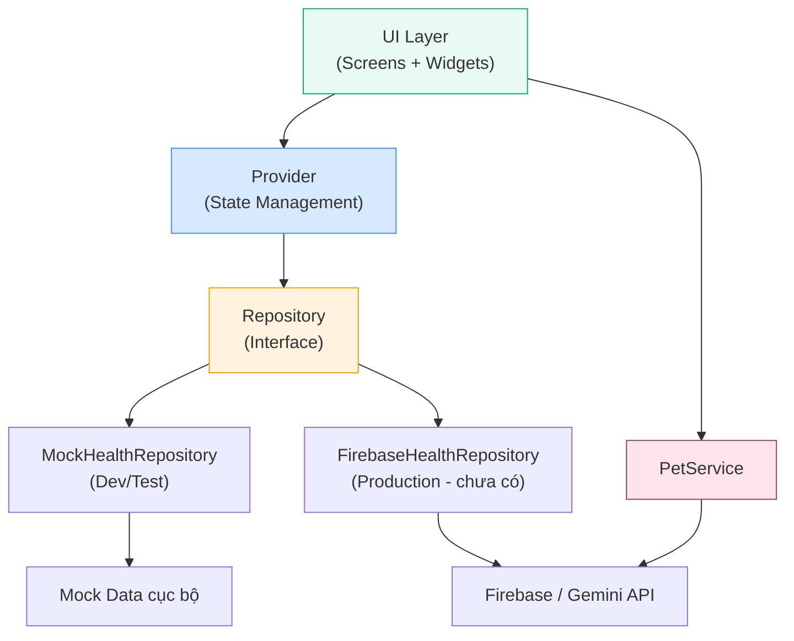
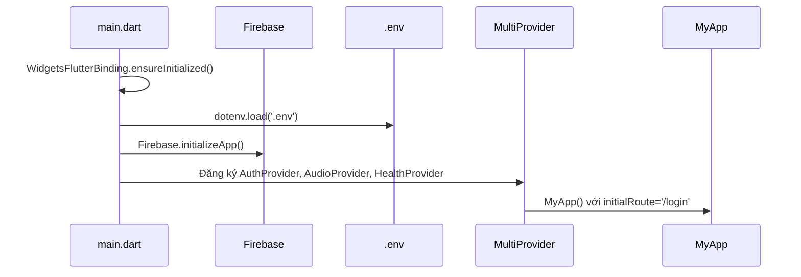
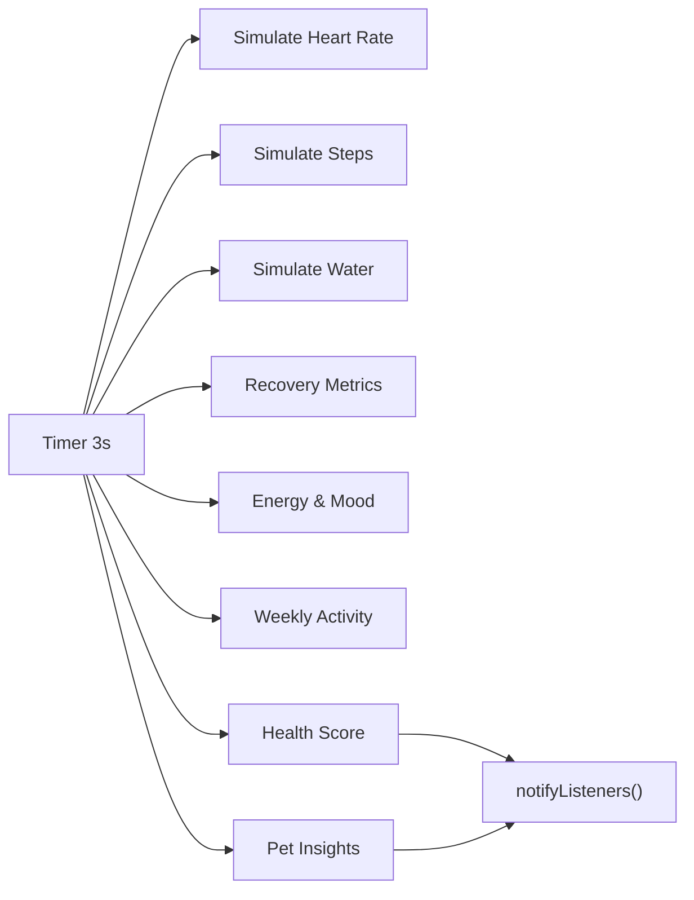
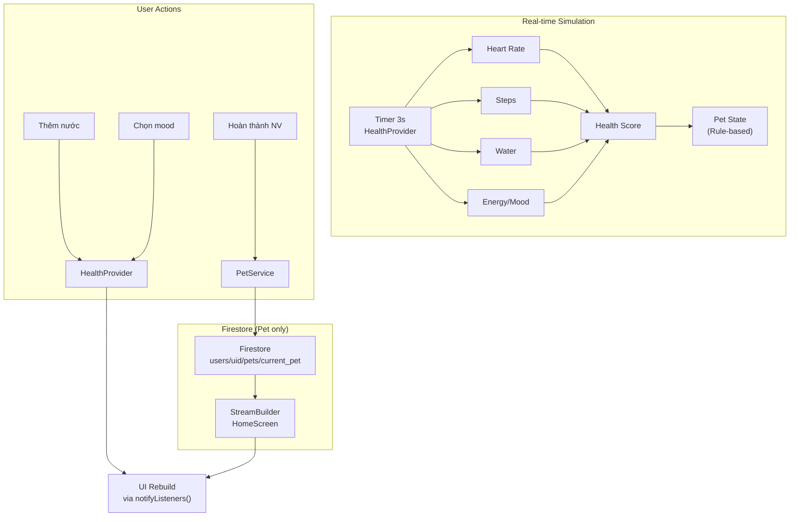

# 📘 Phân Tích Toàn Bộ Source Code — SHCare App

## 1. Tổng Quan Dự Án

**SHCare** là ứng dụng **Flutter chăm sóc sức khỏe thông minh** được phát triển bởi nhóm 4 thành viên. App tích hợp:
- 🐾 **Pet AI** (thú cưng ảo) — Gamification để thúc đẩy người dùng rèn sức khỏe
- 📊 **Thống kê sức khỏe** — Biểu đồ, chỉ số, xu hướng 7 ngày
- 💡 **Gợi ý AI** (Gemini) — Đề xuất cá nhân hóa dựa trên dữ liệu sức khỏe
- 📓 **Nhật ký hàng ngày** — Ghi cảm xúc, nước uống, triệu chứng
- 🎵 **Âm nhạc nền** — Playlist thay đổi theo tâm trạng

> [!IMPORTANT]
> App đang ở giai đoạn **dev/test** với Mock data. Chưa có Firebase Auth/Firestore thật, ngoại trừ tính năng Pet đã kết nối Firestore.

---

## 2. Kiến Trúc Tổng Quan



### Pattern chính: **Repository Pattern + Provider (ChangeNotifier)**

| Layer | Vai trò | Ví dụ |
|-------|---------|-------|
| **UI** | Hiển thị, nhận tương tác | `HomeScreen`, `AIPetWidget` |
| **Provider** | Quản lý state, business logic | `HealthProvider`, `AuthProvider` |
| **Repository** | Interface truy cập data | `HealthRepository` (abstract) |
| **Service** | Giao tiếp API/Firebase trực tiếp | `PetService`, `GeminiService` |
| **Model** | Cấu trúc dữ liệu | `UserModel`, `PetModel`, `DiaryEntry` |

---

## 3. Luồng Khởi Động App



### File: [main.dart](file:///c:/LTMobile/SHCare/shcare_app/lib/main.dart)
- Khởi tạo Flutter engine, load `.env`, init Firebase
- Đăng ký 3 Provider vào `MultiProvider`:
  - `AuthProvider` — xác thực
  - `AudioProvider` — nhạc nền
  - `HealthProvider` — dữ liệu sức khỏe + Pet AI

### File: [app.dart](file:///c:/LTMobile/SHCare/shcare_app/lib/app.dart)
- `MaterialApp` với theme Material 3
- Routes: `/login` → `/register` → `/main`
- Locale: Tiếng Việt (`vi_VN`)

---

## 4. Hệ Thống Data Models (`lib/models/`)

### 4.1 [UserModel](file:///c:/LTMobile/SHCare/shcare_app/lib/models/user_model.dart)
Thông tin người dùng — trung tâm toàn hệ thống.

| Trường | Kiểu | Mô tả |
|--------|------|-------|
| `id`, `email`, `name` | `String` | Thông tin cơ bản |
| `gender` | `String?` | `male`/`female`/`other` |
| `heightCm`, `weightKg` | `double?` | Chỉ số thể chất |
| `stepGoal` | `int` (default 10000) | Mục tiêu bước/ngày |
| `waterGoalLiters` | `double` (default 2.0) | Mục tiêu nước/ngày |

> Có `fromJson()`, `toJson()`, `copyWith()` — sẵn sàng cho Firestore.

### 4.2 [PetModel](file:///c:/LTMobile/SHCare/shcare_app/lib/models/pet_model.dart)
Trạng thái thú cưng AI — hệ thống gamification.

| Trường | Kiểu | Mô tả |
|--------|------|-------|
| `level`, `currentExp`, `expToNextLevel` | `int` | Hệ thống kinh nghiệm |
| `state` | `String` | `'Năng động'`/`'Khát'`/`'Mệt mỏi'`/`'Vui vẻ'` |
| `message` | `String` | Câu nói Pet (từ AI/rule-based) |
| `currentTask` | `String` | Nhiệm vụ Pet giao |
| `isTaskCompleted` | `bool` | Trạng thái hoàn thành |

> Có thêm `fromFirestore()` — đọc trực tiếp từ Firestore `DocumentSnapshot`.

### 4.3 [DiaryEntry](file:///c:/LTMobile/SHCare/shcare_app/lib/models/diary_entry.dart)
Nhật ký sức khỏe hàng ngày — mỗi ngày 1 bản ghi.

| Nhóm | Trường chính |
|------|-------------|
| **Vận động** | `stepCount`, `caloriesBurned` |
| **Nước** | `waterIntakeLiters` |
| **Giấc ngủ** | `sleepMinutes`, `deepSleepMinutes` |
| **Nhịp tim** | `heartRateBpm`, `restingHeartRate`, `hrv` |
| **Tâm trạng** | `moodIndex` (0-3), `energyLevel` (0.0-1.0) |
| **Triệu chứng** | `symptoms` (List), `note` |

### 4.4 [TaskSuggestion](file:///c:/LTMobile/SHCare/shcare_app/lib/models/task_suggestion.dart)
Gợi ý sức khỏe từ AI.

| Trường | Mô tả |
|--------|-------|
| `title`, `description` | Nội dung gợi ý |
| `category` | `'Dinh dưỡng'`/`'Vận động'`/`'Tinh thần'`/`'Ngủ'` |
| `priority` | 1=Cao, 2=TB, 3=Thấp |
| `source` | `'ai'`/`'rule_based'`/`'manual'` |

---

## 5. Repository Pattern

### [HealthRepository](file:///c:/LTMobile/SHCare/shcare_app/lib/repositories/health_repository.dart) — Interface (abstract class)
Định nghĩa 9 phương thức cho toàn bộ thao tác dữ liệu:

```dart
abstract class HealthRepository {
  Future<UserModel?> getCurrentUser();
  Future<void> updateUserProfile(UserModel user);
  Future<DiaryEntry?> getDiaryEntry(String userId, DateTime date);
  Future<List<DiaryEntry>> getDiaryHistory(String userId, {int days = 30});
  Future<void> saveDiaryEntry(DiaryEntry entry);
  Future<PetModel?> getPet(String userId);
  Future<void> updatePet(PetModel pet);
  Future<List<TaskSuggestion>> getTodaySuggestions(String userId);
  Future<void> saveSuggestions(List<TaskSuggestion> suggestions);
  Future<void> completeSuggestion(String suggestionId);
}
```

### [MockHealthRepository](file:///c:/LTMobile/SHCare/shcare_app/lib/repositories/mock_health_repository.dart) — Mock Data
- **User mock**: Admin SHCare, 172cm, 68.5kg, mục tiêu 10000 bước
- **Pet mock**: Level 3, EXP 45, trạng thái "Năng động"
- **30 ngày lịch sử**: Random seed cố định (seed=42) cho kết quả ổn định
- **3 gợi ý AI mẫu**: Dinh dưỡng, Vận động, Tinh thần
- Tất cả hàm có `Future.delayed` giả lập delay mạng

> [!TIP]
> Khi chuyển sang Firebase thật, chỉ cần tạo `FirebaseHealthRepository implements HealthRepository` rồi thay 1 dòng trong Provider.

---

## 6. Phân Tích Từng Feature Module

### 6.1 🔐 Auth — Đăng nhập / Đăng ký

**Files:**
- [AuthProvider](file:///c:/LTMobile/SHCare/shcare_app/lib/providers/auth_provider.dart)
- [LoginScreen](file:///c:/LTMobile/SHCare/shcare_app/lib/features/auth/screens/login_screen.dart)
- [RegisterScreen](file:///c:/LTMobile/SHCare/shcare_app/lib/features/auth/screens/register_screen.dart)

**Cách hoạt động:**
- Sử dụng **mock accounts** (4 tài khoản test cứng)
- Hỗ trợ: Email/Password, Google (mock), Facebook (mock)
- Validation: email rỗng, password < 6 ký tự, email trùng
- Đăng nhập thành công → `pushReplacementNamed('/main')`

**Mock Accounts:**
| Email | Password | Tên |
|-------|----------|-----|
| `admin@shcare.vn` | `admin123` | Admin SHCare |
| `khang@shcare.vn` | `khang123` | Huỳnh Vĩnh Khang |
| `test@shcare.vn` | `test1234` | Tester SHCare |
| `demo@shcare.vn` | `demo1234` | Demo User |

---

### 6.2 🏠 Home — Trang Chủ + Pet AI

**Files chính:**
- [HomeScreen](file:///c:/LTMobile/SHCare/shcare_app/lib/features/home/screens/home_screen.dart) — 635 dòng
- [AIPetWidget](file:///c:/LTMobile/SHCare/shcare_app/lib/features/home/widgets/ai_pet_widget.dart) — 723 dòng
- [HealthProvider](file:///c:/LTMobile/SHCare/shcare_app/lib/features/home/providers/health_provider.dart) — 476 dòng
- [PetService](file:///c:/LTMobile/SHCare/shcare_app/lib/services/pet/pet_service.dart) — 103 dòng

#### HomeScreen — Cấu trúc giao diện:
```
┌──────────────────────────────┐
│  HomeTopGreeting("Khang")    │
│  HomeDailySummaryCard        │  ← Bước chân, % hoàn thành
│  ┌────────┐  ┌────────┐     │
│  │Nhịp tim│  │  Nước  │     │  ← 2 metric card song song
│  └────────┘  └────────┘     │
│  HomeSleepHighlightCard      │  ← Chế độ ngủ, kích hoạt playlist
│  ┌──────────────────────┐    │
│  │   🐾 PET AI ZONE     │   │  ← StreamBuilder<PetModel>
│  │   FantasyEnvironment  │   │     từ Firestore realtime
│  │   AIPetWidget         │   │
│  │   EXP Bar             │   │
│  │   Pet Dialogue Card   │   │
│  └──────────────────────┘    │
│  [Test: +30 EXP Button]     │
│  HomePlanListCard            │
│  HomeRecentActivityCard      │
└──────────────────────────────┘
```

#### HealthProvider — Trung tâm quản lý state:
- **Simulation engine**: Timer 3 giây, mô phỏng liên tục nhịp tim, bước chân, nước, năng lượng
- **Health Score**: Tính từ 5 yếu tố (bước, nước, HRV, giấc ngủ, năng lượng) với trọng số
- **Pet Insights**: Rule-based — kiểm tra hydration, fatigue → đổi state Pet
- **EXP System**: +20 EXP/nhiệm vụ, 100 EXP = lên 1 cấp



#### AIPetWidget — Animation System:
Sprite-based pet với **5 trạng thái animation**:

| State | Animation | Trigger |
|-------|-----------|---------|
| `idle` | Float + Breath (lặp) | Mặc định |
| `attack` | Lao tới + xoay | Tap vào pet |
| `levelUp` | Nhảy cao + thu phóng + particle stars | Lên cấp |
| `sleeping` | Nghiêng qua lại + "zzz" | Pet mệt/khát |
| `walking` | Di chuyển ngang + lắc | Trạng thái walking |

- Có 8 class (Warrior, Archer, Rogue, Mage, Knight, Necromancer, Berserker, Monk)
- Câu thoại load từ `assets/data/quotes.json`
- Thought bubble thay đổi màu theo level

#### PetService — Kết nối Firestore:
- **streamPetData()**: Lắng nghe realtime từ `users/{userId}/pets/current_pet`
- **gainExperience()**: Transaction an toàn — cộng EXP, kiểm tra level up, scale `expToNextLevel * 1.5`

> [!WARNING]
> `PetService` kết nối **Firestore thật**, trong khi phần còn lại dùng Mock. Đây là sự không nhất quán cần lưu ý.

---

### 6.3 📊 Stats — Thống Kê Sức Khỏe

**Files:**
- [StatsScreen](file:///c:/LTMobile/SHCare/shcare_app/lib/features/stats/screens/stats_screen.dart)
- [stats_sections.dart](file:///c:/LTMobile/SHCare/shcare_app/lib/features/stats/widgets/stats_sections.dart)
- [health_score_card.dart](file:///c:/LTMobile/SHCare/shcare_app/lib/features/stats/widgets/health_score_card.dart)
- [sleep_stage_visualizer.dart](file:///c:/LTMobile/SHCare/shcare_app/lib/features/stats/widgets/sleep_stage_visualizer.dart)

**Hiển thị:**
- 🏥 Health Score Card (60-98 điểm) + message AI
- 📈 4 insight metrics: HRV, Resting HR, Calories, Deep Sleep
- 📊 Weekly Activity Bar Chart (7 ngày)
- 😴 Sleep Stage Visualizer

---

### 6.4 💡 Tips — Gợi Ý Thông Minh

**Files:**
- [TipsScreen](file:///c:/LTMobile/SHCare/shcare_app/lib/features/tips/screens/tips_screen.dart)
- [featured_tip_card.dart](file:///c:/LTMobile/SHCare/shcare_app/lib/features/tips/widgets/featured_tip_card.dart)
- [tips_sections.dart](file:///c:/LTMobile/SHCare/shcare_app/lib/features/tips/widgets/tips_sections.dart)

**Cách hoạt động:**
- Gợi ý được sinh **rule-based** từ `HealthProvider` data (bước, nước, nhịp tim, năng lượng)
- Featured Tip Card nổi bật ở đầu
- Phân loại theo chip: Tất cả, Dinh dưỡng, Vận động, Tinh thần
- Mini Habit cards: Uống nước, Giờ ngủ

> [!NOTE]
> `gemini_service.dart` hiện **trống rỗng** — AI Gemini chưa được implement. Tips đang dùng hoàn toàn rule-based.

---

### 6.5 📓 Journal — Nhật Ký Sức Khỏe

**Files:**
- [JournalScreen](file:///c:/LTMobile/SHCare/shcare_app/lib/features/journal/screens/journal_screen.dart)
- [journal_sections.dart](file:///c:/LTMobile/SHCare/shcare_app/lib/features/journal/widget/journal_sections.dart)

**Luồng nhập liệu:**
1. **Cảm xúc**: 4 mood cards (Rất tốt → Căng thẳng) — chọn mood → đổi playlist nhạc
2. **Nước uống**: +/- 250ml/ly, cập nhật realtime vào `HealthProvider`
3. **Năng lượng**: Slider 0.0 → 1.0, liên kết 2 chiều với mood
4. **Triệu chứng**: FilterChip (Mỏi cổ vai, Mất tập trung, Đau đầu nhẹ, Mất ngủ, Không có)
5. **Ghi chú tự do**: TextField, nút "Lưu check-in hôm nay"

> [!WARNING]
> Nút "Lưu check-in hôm nay" hiện `onPressed: () {}` — **chưa có logic lưu**!

---

### 6.6 🧭 Main — Navigation Container

**File:** [MainScreen](file:///c:/LTMobile/SHCare/shcare_app/lib/features/main/screens/main_screen.dart)

- `IndexedStack` giữ 4 tab trong memory (không rebuild khi chuyển tab)
- `NavigationBar` Material 3 với icon GIF động
- **Music Play Button** nổi — draggable trên toàn màn hình, vị trí lưu `SharedPreferences`
- Auto play BGM khi vào MainScreen

---

## 7. Design System

### [AppColors](file:///c:/LTMobile/SHCare/shcare_app/lib/core/theme/app_colors.dart) — Hệ thống màu
- **Primary**: `#0FA87E` (xanh mint) — brand chính
- **Scaffold**: `#F5F9F7` — nền sáng nhẹ
- **Card**: White + border `#E2ECE7`
- 4 gradient presets: `primaryGradient`, `heroGradient`, `darkGradient`
- 4 border radius presets: 12, 18, 24, 32

### [AppTheme](file:///c:/LTMobile/SHCare/shcare_app/lib/core/theme/app_theme.dart) — Theme Material 3
- Font: **PlusJakartaSans**
- NavigationBar: 72px height, indicator xanh mint
- Buttons: Filled, Outlined, Elevated — đều bo góc `radiusMd` (18px)
- Input: Filled style + focus border xanh

---

## 8. Luồng Dữ Liệu Chính



---

## 9. Nhận Xét & Đánh Giá

### ✅ Điểm mạnh
1. **Kiến trúc rõ ràng** — Repository Pattern giúp tách biệt data source, dễ test
2. **Mock data hoàn chỉnh** — 4 thành viên có thể làm song song không chờ nhau
3. **Animation phong phú** — Pet có 5 trạng thái animation, particle effects, aura effects
4. **Gamification hay** — Hệ thống EXP/Level tạo động lực cho người dùng
5. **Âm nhạc thích ứng** — Playlist thay đổi theo mood/tâm trạng
6. **Documentation tốt** — README chi tiết, comment rõ ràng trong code

### ⚠️ Điểm cần cải thiện

| Vấn đề | Chi tiết | Mức độ |
|--------|----------|--------|
| **GeminiService trống** | `gemini_service.dart` và `firestore_service.dart` chưa code | 🔴 Cao |
| **Journal chưa lưu** | Nút "Lưu check-in" có `onPressed: () {}` | 🔴 Cao |
| **Data source không nhất quán** | Pet dùng Firestore thật, còn lại dùng Mock | 🟡 TB |
| **HealthProvider quá lớn** | 476 dòng, nên tách thành nhiều provider nhỏ | 🟡 TB |
| **Hardcode userName** | `'Khang'` cứng nhiều nơi, chưa lấy từ AuthProvider | 🟡 TB |
| **Thiếu error handling** | PetService không handle khi Firestore offline | 🟡 TB |
| **Thiếu Unit Tests** | Thư mục `test/` trống | 🟡 TB |
| **File lớn** | `ai_pet_widget.dart` 723 dòng, `home_screen.dart` 635 dòng | 🟢 Thấp |
| **Naming inconsistency** | `journal/widget/` vs `journal/widgets/` (thiếu s) | 🟢 Thấp |

### 🚀 Gợi ý tiếp theo
1. Implement `GeminiService` — tích hợp AI thực sự
2. Hoàn thiện logic lưu Journal → gọi `repo.saveDiaryEntry()`
3. Lấy `userName` từ `AuthProvider` thay vì hardcode
4. Tách `HealthProvider` thành `VitalsProvider` + `PetProvider`
5. Viết Unit Test cho Repository và Provider
6. Thống nhất Pet data source — dùng Repository pattern cho PetService

---

## 10. Cấu Trúc File Hoàn Chỉnh

```
lib/
├── main.dart                              ← Entry point, Firebase init, Provider setup
├── app.dart                               ← MaterialApp, routes, theme
├── core/
│   ├── config/firebase_options.dart        ← Firebase config
│   ├── constants/app_strings.dart          ← Chuỗi hằng
│   ├── providers/audio_provider.dart       ← Nhạc nền, playlist theo mood
│   ├── theme/
│   │   ├── app_colors.dart                 ← Hệ thống màu (93 dòng)
│   │   └── app_theme.dart                  ← Material 3 theme (261 dòng)
│   └── widgets/gif_icon.dart               ← Widget icon GIF động
├── models/
│   ├── user_model.dart                     ← 95 dòng — Thông tin user
│   ├── pet_model.dart                      ← 124 dòng — Pet AI state
│   ├── diary_entry.dart                    ← 147 dòng — Nhật ký hàng ngày
│   └── task_suggestion.dart                ← 91 dòng — Gợi ý AI
├── repositories/
│   ├── health_repository.dart              ← 49 dòng — Interface
│   └── mock_health_repository.dart         ← 210 dòng — Mock data
├── providers/
│   └── auth_provider.dart                  ← 200 dòng — Xác thực mock
├── services/
│   ├── ai/gemini_service.dart              ← ⚠️ TRỐNG
│   ├── firebase/firestore_service.dart     ← ⚠️ TRỐNG
│   └── pet/pet_service.dart                ← 103 dòng — Firestore realtime
├── features/
│   ├── auth/screens/
│   │   ├── login_screen.dart               ← 20KB — UI đăng nhập
│   │   └── register_screen.dart            ← 25KB — UI đăng ký
│   ├── home/
│   │   ├── providers/health_provider.dart   ← 476 dòng — State hub
│   │   ├── screens/home_screen.dart         ← 635 dòng — Trang chủ
│   │   └── widgets/
│   │       ├── ai_pet_widget.dart           ← 723 dòng — Pet animation
│   │       ├── pet_aura_effect.dart         ← Hiệu ứng aura
│   │       ├── fantasy_environment.dart     ← Môi trường RPG
│   │       ├── rpg_pixel_background.dart    ← Background pixel art
│   │       ├── home_sections.dart           ← Cards, metrics
│   │       ├── music_play_button.dart       ← Nút nhạc draggable
│   │       └── ...6 widget cards khác
│   ├── stats/
│   │   ├── screens/stats_screen.dart        ← Màn thống kê
│   │   └── widgets/ (3 files)
│   ├── tips/
│   │   ├── screens/tips_screen.dart         ← Màn gợi ý
│   │   └── widgets/ (2 files)
│   ├── journal/
│   │   ├── screens/journal_screen.dart      ← Màn nhật ký
│   │   └── widget/ (3 files)               ← ⚠️ Thiếu 's' trong tên folder
│   └── main/screens/
│       ├── main_screen.dart                 ← BottomNav container
│       └── pet_dashboard_screen.dart        ← Dashboard Pet
└── utils/
    ├── date_formatter.dart                  ← Format ngày tiếng Việt
    └── rive_analyzer.dart                   ← Phân tích file Rive
```
